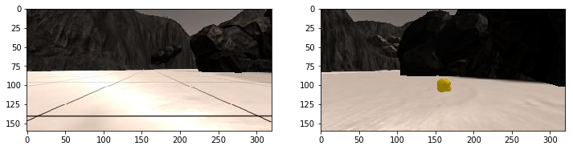
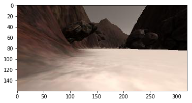
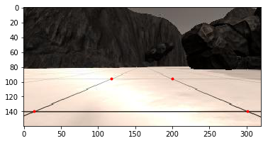
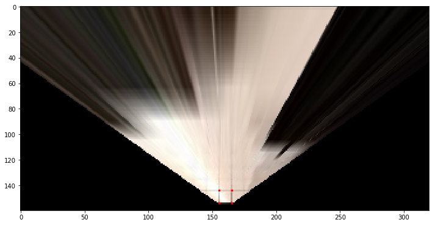
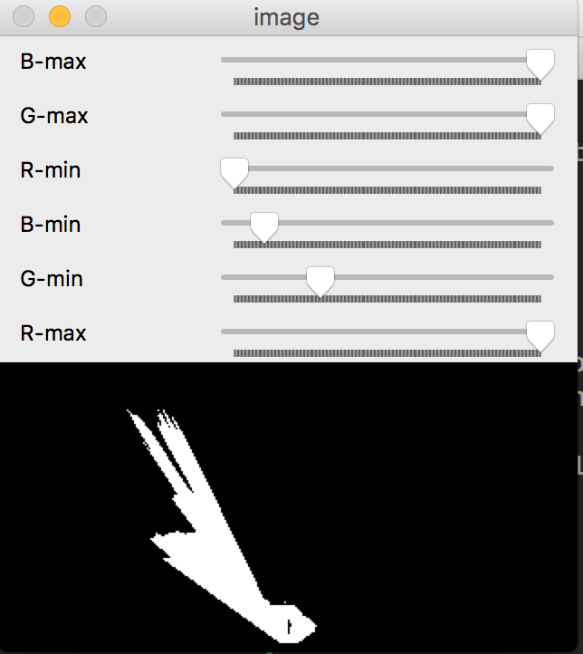
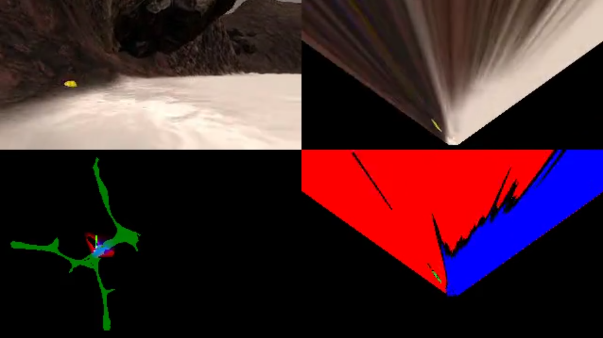
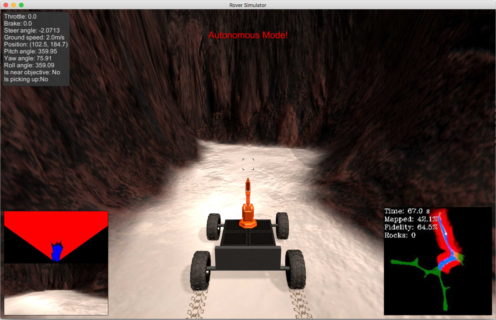

## Project: Search and Sample Return
---


**The goals / steps of this project are the following:**  

**Training / Calibration**  

* Download the simulator and take data in "Training Mode"
* Test out the functions in the Jupyter Notebook provided
* Add functions to detect obstacles and samples of interest (golden rocks)
* Fill in the `process_image()` function with the appropriate image processing steps (perspective transform, color threshold etc.) to get from raw images to a map.  The `output_image` you create in this step should demonstrate that your mapping pipeline works.
* Use `moviepy` to process the images in your saved dataset with the `process_image()` function.  Include the video you produce as part of your submission.

**Autonomous Navigation / Mapping**

* Fill in the `perception_step()` function within the `perception.py` script with the appropriate image processing functions to create a map and update `Rover()` data (similar to what you did with `process_image()` in the notebook). 
* Fill in the `decision_step()` function within the `decision.py` script with conditional statements that take into consideration the outputs of the `perception_step()` in deciding how to issue throttle, brake and steering commands. 
* Iterate on your perception and decision function until your rover does a reasonable (need to define metric) job of navigating and mapping.  

## [Rubric](https://review.udacity.com/#!/rubrics/916/view) Points
### Here I will consider the rubric points individually and describe how I addressed each point in my implementation.  

---

### Notebook Analysis

#### 1. Looking into the data

Images provided by Udacity 



And one sample from recorded dataset



#### 2. Reference coordinates

I've used the example grid image above to choose source points for the grid cell in front of the rover (each grid cell is 1 square meter in the simulator). 

The coordinates are the following [14, 140], [301 ,140],[200, 96], [118, 96] (4 points , x & y)
And looks as following if plotted:



#### 3. Bird-eye view

Using the coordinates from the above I applied perspective transformation to the image using OpenCV [getPerspectiveTransform](http://docs.opencv.org/2.4/modules/imgproc/doc/geometric_transformations.html#getperspectivetransform) function, and got the following picture:



You can see the source points that were converted to destination points in red.

#### 4. Path / Obstacles / Rocks selection

In the simulator rocks, obstacles and path are of different color and could be seperated by RGB color thresholding.
I have put together simple Trackbar using OpenCV that looks like this:



It is possible to set min/max value for RGB channels and the output will be shown in the windows below as soon as you make changes. It was really helpful to define a threshold for rock detection using that.

I ended up with the following parameters for the detection

```
rock_min_thresh = (155, 0, 0)
rock_max_thresh = (255, 255, 117)
path_min_thresh = (120, 120, 120)
path_max_thresh = (255,255,255)
obst_min_thresh = (0, 0, 0)
obst_max_thresh = path_min_thresh (NOT path)
```

#### 5. Pipeline `process_image()`

After putting it all togethe with the appropriate analysis steps to map pixels identifying navigable terrain, obstacles and rock samples into a worldmap we get the following resultant image:



#### 6. Processing video 

Running `process_image()` on test data using the `moviepy` functions provided to create video output ofresult. 

[Video link](output/test_mapping.mp4)

### Autonomous Navigation and Mapping

#### 1. Perception

Using the same preprocessing and analysis from the pipeline we do process the image from the simulator in real time and return it back to display. All is done in the `perception_step()` (at the bottom of the `perception.py` script).

#### 2. Decision

In `decision_step()` (in `decision.py`) function for autonomous driving I have limited the rover to steer only in range of -5 to 15 degree, which made is steer more to the left side and act like a wall crawler.  

#### 3. Launching in autonomous mode rover can navigate and map autonomously. 

Here are the results of one minute drive:



I ran the simulator with settings set as 1280x800 & Fantastic quality and observed the FPS of about 19-25 along the drive.

#### Things to improve / Problems discussion

There is definitely a lot of space to improve as that was the most naive idea to just crawl the walls.
Instead of color thresholding I would like to train CNN to make a decision of steering the wheel and may be even control the speed.

Pipeline may fail on the small obstacles in the middle of the scene as they are not being processed explicitly and averaging here does a bad job (neglects them). I think CNN will perform much better on that.


